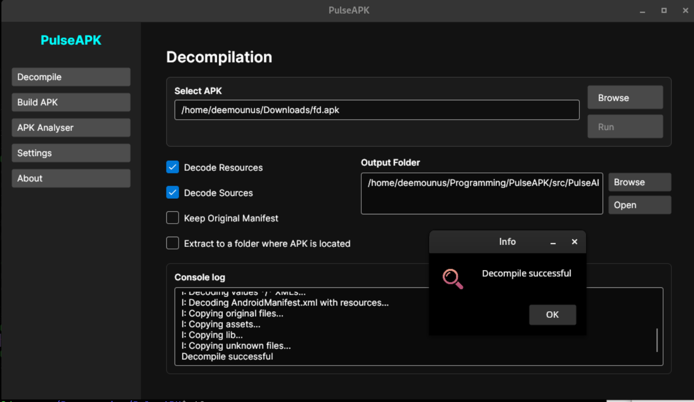
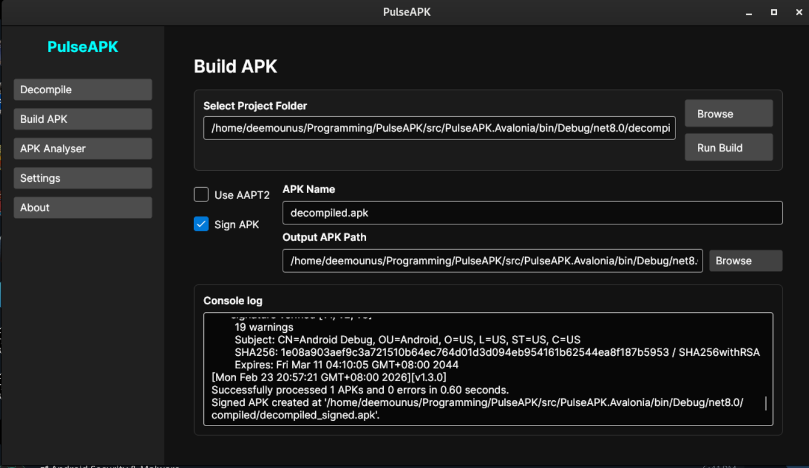
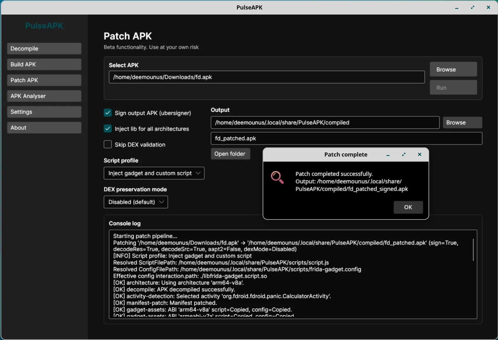
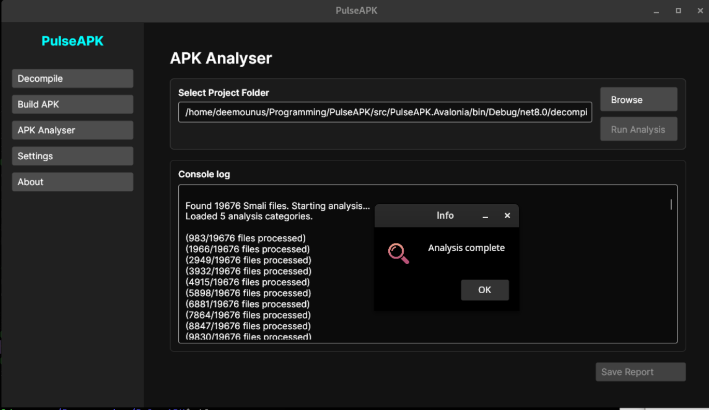

# PulseAPK

<p align="center">
  <a href="https://github.com/deemoun/PulseAPK-Core/stargazers"></a>
  <a href="https://github.com/deemoun/PulseAPK-Core/network/members"></a>
  <a href="https://github.com/deemoun/PulseAPK-Core/issues"></a>
  <a href="LICENSE.md"></a>
  <a href="https://github.com/deemoun/PulseAPK-Core/commits"></a>
</p>
<p align="center">
  🌍 <strong>Languages</strong><br>
  <a href="README.md">English</a> |
  <a href="README.de.md">Deutsch</a> |
  <a href="README.es.md">Español</a> |
  <a href="README.fr.md">Français</a> |
  <a href="README.he.md">עברית</a> |
  <a href="README.ko.md">한국어</a> |
  <a href="README.be.md">Беларуская</a> |
  <a href="README.fi.md">Suomi</a> |
  <a href="README.lv.md">Latviešu</a> |
  <a href="README.et.md">Eesti</a> |
  <a href="README.lt.md">Lietuvių</a> |
  <a href="README.cs.md">Čeština</a> |
  <a href="README.sk.md">Slovenčina</a> |
  <a href="README.hu.md">Magyar</a> |
  <a href="README.ar.md">العربية</a> |
  <a href="README.pt.md">Português</a> |
  <a href="README.ru.md">Русский</a> |
  <a href="README.uk.md">Українська</a> |
  <a href="README.zh.md">中文</a>
</p>

**PulseAPK** is a professional-grade, cross-platform GUI for Android reverse engineering and security analysis, built with Avalonia and .NET 8. It combines the raw power of `apktool` with advanced static analysis capabilities, wrapped in a high-performance, cyberpunk-inspired interface. PulseAPK streamlines the entire workflow from decompilation to analysis, rebuilding, and signing.

[Overview of PulseAPK functionality](https://youtu.be/Mkdt0c-7Wwg)

[PulseAPK Patching functionality overview](https://youtu.be/iu-LOHj5QVM)

PulseAPK is organized into a single-window workflow with a left sidebar for each tool: **Decompile**, **Build APK**, **Patch APK**, **Analyser**, **Settings**, and **About**. The optional **Device Tools** tab can be enabled from **Settings** when you want ADB-assisted workflows. Each section focuses on one stage of the APK lifecycle so you can move from decoding to analysis, patching, device interaction, rebuilding, and signing without leaving the app.

## Screenshots

### 1) Decompile workflow

- Use this screen to pick an input APK and output folder, then run decompilation.
- Simple flow: select APK -> set output path -> click decompile.

### 2) Build workflow

- Use this screen to rebuild a decompiled project into a new APK.
- Simple flow: select project folder -> choose output name/path -> click build (and enable signing if needed).

### 3) Patching workflow

- Use this screen to automate APK patching actions, including Frida gadget injection.
- Simple flow: load APK/project -> choose patching options -> run patch -> verify output.

### 4) Static analysis results

- This view shows security findings from Smali/static analysis.
- Simple flow: decompile first -> open analysis tab/output -> review findings and export report.

## Key Features

- **🛡️ Static Security Analysis**: Automatically scan Smali code for vulnerabilities, including root detection, emulator checks, hardcoded credentials, and insecure SQL/HTTP usage.
- **⚙️ Dynamic Rule Engine**: Fully customizable analysis rules via `smali_analysis_rules.json`. Modify detection patterns on the fly without restarting the application. Uses caching for optimal performance.
- **🚀 Modern UI/UX**: A responsive, dark-themed interface designed for efficiency, with real-time console feedback.
- **📦 Complete Workflow**: Decompile, Analyze, Patch, Recompile, and Sign APKs in one unified environment.
- **🧩 APK Patching**: Automate Frida gadget injection, manifest updates, dex validation, architecture selection, and optional output signing from the patching workspace.
- **📱 Optional Device Tools**: Enable ADB workflows for connected devices, including APK install, launch, app maintenance, package lookup, screenshots, screen recording, logcat presets, and custom shell/ADB commands.
- **⚡ Safe & Robust**: Includes intelligent validation and crash prevention mechanisms to protect your workspace and data.
- **🔧 Fully Configurable**: Manage tool paths (Java, Apktool, Uber APK Signer, ADB), language, theme, beta features, workspace settings, and analysis parameters with ease.

## Advanced Capabilities

### Security Analysis
PulseAPK includes a built-in static analyzer that scans decompiled code for common security indicators:
- **Root Detection**: Identifies checks for Magisk, SuperSU, and common root binaries.
- **Emulator Detection**: Finds checks for QEMU, Genymotion, and specific system properties.
- **Sensitive Data**: Scans for hardcoded API keys, tokens, and basic auth headers.
- **Insecure Networking**: Flags HTTP usage and potential data leakage points.

*Rules are defined in `smali_analysis_rules.json` and can be customized to your specific needs.*

### APK Management
- **Decompile**: Select an APK, choose decode options (resources, sources, manifest handling), and extract to an output folder or the APK’s own folder.
- **Build APK**: Recompile from a project folder, set output name and location, toggle AAPT2, and optionally sign the APK in one step with Uber APK Signer.
- **Patch APK**: Use the dedicated patcher tab to automate APK patching workflows, including Frida setup with one-click **Inject frida-gadget** support, architecture-aware gadget placement, manifest updates, dex validation controls, and optional output signing.
- **Analyser**: Point to a decompiled project folder, run the Smali analysis, and export the report when needed.
- **Settings**: Configure language, dark/light theme, Apktool, Uber APK Signer, ADB path detection, and beta feature visibility. Settings are stored in the user app-data folder instead of the application directory.
- **Device Tools**: Optional beta tab for ADB-backed device work. When enabled in **Settings**, PulseAPK auto-detects ADB from the configured path, `ADB_PATH`, `ANDROID_HOME`, `ANDROID_SDK_ROOT`, `~/Android/Sdk/platform-tools`, or `PATH`; then it can refresh devices, install APKs, detect package/activity metadata with `aapt`, launch apps/activities, force-stop, clear data, uninstall, open Android app settings, copy APKs from a device, capture screenshots, record the screen, run logcat/package presets, and execute custom shell or raw ADB arguments.

## Prerequisites

1.  **Java Runtime Environment (JRE)**: Required for `apktool`. Ensure `java` is in your system `PATH`.
2.  **Apktool**: You can download `apktool.jar` directly from PulseAPK by pressing the download button in **Settings**, or provide it manually from [ibotpeaches.github.io](https://ibotpeaches.github.io/Apktool/).
3.  **Ubersign (Uber APK Signer)**: Required for signing rebuilt APKs. You can download the latest `uber-apk-signer.jar` automatically in **Settings**, or still provide it manually from the [GitHub releases](https://github.com/patrickfav/uber-apk-signer/releases).
4.  **.NET 8.0 SDK/Runtime**: Required when building or running from source with `dotnet build` / `dotnet run`. Published desktop artifacts are built as self-contained packages where the platform build supports it.
5.  **ADB / Android SDK platform-tools (optional)**: Required only for the beta **Device Tools** tab. PulseAPK can auto-detect `adb` from Settings, `ADB_PATH`, Android SDK environment variables, the default user SDK folder, or your system `PATH`. `aapt` from Android SDK build-tools enables APK package/activity detection.
6.  **macOS hosts**: Release artifacts target Apple Silicon only (`osx-arm64`) and produce a self-contained `.app` bundle in a ZIP. Intel/x64 macOS builds are not produced by the release scripts. The generated bundle declares macOS 11.0 or newer as its minimum system version.

## Quick Start Guide

1.  **Download and Build**
    ```powershell
    dotnet build
    dotnet run
    ```

    To create the macOS Apple Silicon app bundle artifact:
    ```bash
    RID=osx-arm64 ./scripts/build-macos-binary.sh
    ```

    The macOS build uses ad-hoc signing by default for local and test builds. For production signing, install a Developer ID Application certificate in the macOS keychain and set `MACOS_CODESIGN_IDENTITY` to that certificate identity before running the script. To notarize the generated ZIP and staple the notarization ticket to the `.app` before the final ZIP is created, also set `APPLE_ID`, `APPLE_TEAM_ID`, and `APPLE_APP_SPECIFIC_PASSWORD`. GitHub Actions release builds read these values from repository secrets with the same names: `MACOS_CODESIGN_IDENTITY`, `APPLE_ID`, `APPLE_TEAM_ID`, and `APPLE_APP_SPECIFIC_PASSWORD`.

2.  **Setup**
    - Open **Settings**.
    - Link your `apktool.jar` and `uber-apk-signer.jar` paths, or use the built-in download buttons.
    - Configure **ADB Path** only if auto-detection does not find your Android platform-tools installation.
    - Choose language and dark/light theme preferences.
    - Enable **Device Tools** under **Beta Features** if you need connected-device workflows.
    - PulseAPK will display the Java runtime it detects from your environment variables.

3.  **Analyze an APK**
    - **Decompile** your target APK using the Decompile tab.
    - Switch to the **Analyser** tab.
    - Select your decompiled project folder.
    - Click **Analyze Smali** to generate a security report.
    - Save the report from the footer action when you are ready.

4.  **Modify & Rebuild**
    - Edit files in your project folder.
    - Use the **Build** tab to recompile into a new APK.
    - Toggle signing during the build step to sign the output APK.

5.  **Use Device Tools (optional beta)**
    - Open **Settings** and enable **Device Tools**.
    - Make sure `adb` is available through **ADB Path**, `ADB_PATH`, `ANDROID_HOME`, `ANDROID_SDK_ROOT`, `~/Android/Sdk/platform-tools`, or `PATH`.
    - Connect a device with USB debugging enabled, refresh the device list, and choose a workflow such as install APK, launch/manage app, copy APK from device, screenshot, screen recording, presets, or custom shell/ADB commands.

## Technical Architecture

PulseAPK utilizes a clean MVVM (Model-View-ViewModel) architecture:

- **Core**: .NET 8.0, Avalonia (cross-platform UI).
- **Analysis**: Custom Regex-based static analysis engine with hot-reloadable rules.
- **Services**: Dedicated services for Apktool interaction, patch orchestration, Android Debug Bridge integration, file system monitoring, tool downloads, and settings management.

## License

This project is open-source and available under the [Apache License 2.0](LICENSE.md).

## Attribution and Copyright

- Licensing terms are defined by [LICENSE.md](LICENSE.md) (Apache-2.0).
- Contributor licensing and ownership terms are defined by [CLA.md](CLA.md).
- Project-level copyright and attribution practices are documented in [NOTICE](NOTICE).
- Per-file copyright/license headers are **optional** unless a file requires an explicit third-party notice; repository-level `LICENSE.md` and `NOTICE` remain authoritative.
- Contributors do **not** need to add themselves to a separate acknowledgements list in this repository; attribution is handled through Git history, pull request metadata, and signed CLA records.

### ❤️ Support the project

If PulseAPK is useful for you, you can support its development by pressing the "Support" button at the top

Even a small tip helps a lot.

### Contributing

We welcome contributions! Please note that all contributors must sign our [Contributor License Agreement (CLA)](CLA.md) to ensure that their work can be legally distributed.
By submitting a pull request, you agree to the terms of the CLA.
