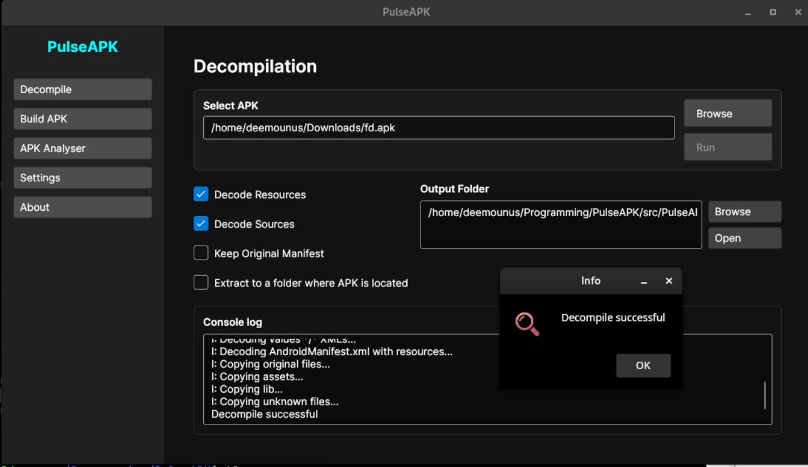
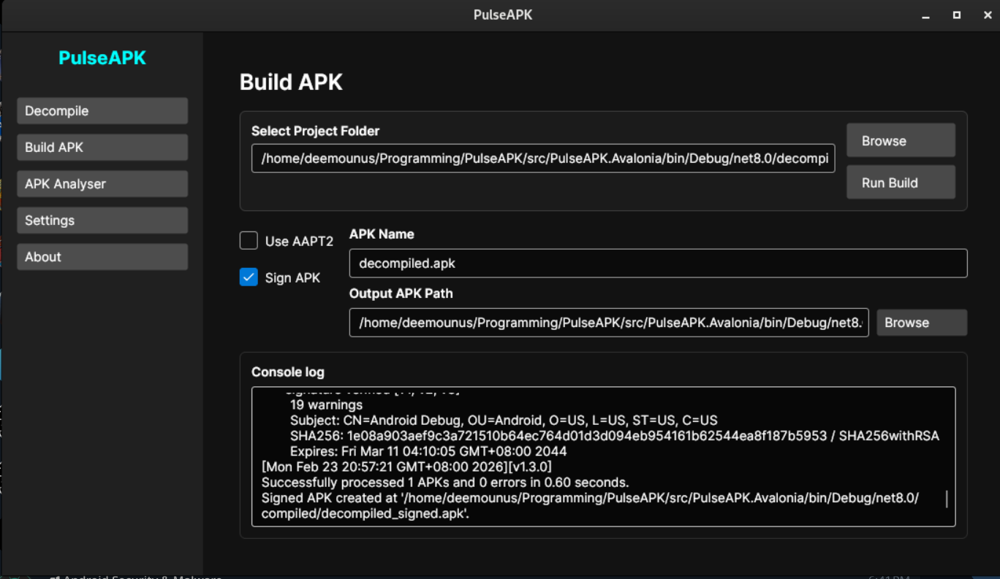

# PulseAPK

**PulseAPK**는 Avalonia (.NET 8)로 구축된 Android 리버스 엔지니어링 및 보안 분석용 전문 GUI입니다. `apktool`의 강력함과 고급 정적 분석 기능을 결합해 사이버펑크 스타일의 고성능 인터페이스로 제공합니다. PulseAPK는 디컴파일부터 분석, 재빌드, 서명까지 전체 워크플로를 간소화합니다.

[YouTube 데모 보기](https://youtu.be/Mkdt0c-7Wwg)



Use the Analysis tab to select the decompiled project folder and run Smali analysis.


Smali 폴더를 빌드(필요 시 서명)하려면 "Build APK" 섹션을 사용하세요.



## 주요 기능

- **🛡️ 정적 보안 분석**: Smali 코드를 자동으로 스캔해 루트 탐지, 에뮬레이터 체크, 하드코딩된 자격 증명, 안전하지 않은 SQL/HTTP 사용을 찾습니다.
- **⚙️ 동적 규칙 엔진**: `smali_analysis_rules.json`을 통해 분석 규칙을 완전히 커스터마이즈할 수 있습니다. 애플리케이션 재시작 없이 탐지 패턴을 변경할 수 있으며, 캐싱으로 최적의 성능을 제공합니다.
- **🚀 현대적인 UI/UX**: 드래그 앤 드롭과 실시간 콘솔 피드백을 갖춘 반응형 다크 테마 인터페이스.
- **📦 완전한 워크플로**: 디컴파일, 분석, 편집, 재컴파일, 서명을 하나의 환경에서 수행합니다.
- **⚡ 안전하고 견고함**: 작업 공간과 데이터를 보호하기 위한 지능형 검증 및 크래시 방지 메커니즘을 포함합니다.
- **🔧 완전한 설정 가능**: 도구 경로(Java, Apktool), 작업 공간 설정, 분석 파라미터를 쉽게 관리합니다.

## 고급 기능

### 보안 분석
PulseAPK는 디컴파일된 코드를 스캔하여 일반적인 보안 지표를 찾는 내장 정적 분석기를 포함합니다:
- **루트 탐지**: Magisk, SuperSU 및 일반적인 루트 바이너리 체크를 식별합니다.
- **에뮬레이터 탐지**: QEMU, Genymotion 및 특정 시스템 속성 체크를 찾습니다.
- **민감 데이터**: 하드코딩된 API 키, 토큰, Basic 인증 헤더를 스캔합니다.
- **안전하지 않은 네트워킹**: HTTP 사용과 잠재적인 데이터 유출 지점을 표시합니다.

*규칙은 `smali_analysis_rules.json`에 정의되어 있으며 필요에 맞게 커스터마이즈할 수 있습니다.*

### APK 관리
- **디컴파일**: 설정 가능한 옵션으로 리소스와 소스를 손쉽게 디코드합니다.
- **재컴파일**: 수정한 프로젝트를 유효한 APK로 재빌드합니다.
- **서명**: 재빌드된 APK가 설치 준비가 되도록 통합 키스토어 관리 기능을 제공합니다.

## 사전 요구 사항

1.  **Java Runtime Environment (JRE)**: `apktool`에 필요합니다. `java`가 시스템 `PATH`에 있는지 확인하세요.
2.  **Apktool**: [ibotpeaches.github.io](https://ibotpeaches.github.io/Apktool/)에서 `apktool.jar`를 다운로드하세요.
3.  **Ubersign (Uber APK Signer)**: 재빌드된 APK 서명에 필요합니다. [GitHub releases](https://github.com/patrickfav/uber-apk-signer/releases)에서 최신 `uber-apk-signer.jar`를 다운로드하세요.
4.  **.NET 8.0 Runtime**: Windows에서 PulseAPK를 실행하려면 필요합니다.

## 빠른 시작 가이드

1.  **다운로드 및 빌드**
    ```powershell
    dotnet build
    dotnet run
    ```

2.  **설정**
    - **Settings**를 엽니다.
    - `apktool.jar` 경로를 연결합니다.
    - PulseAPK는 환경 변수에 따라 Java 설치를 자동으로 감지합니다.

3.  **APK 분석**
    - Decompile 탭에서 대상 APK를 **디컴파일**합니다.
    - **Analysis** 탭으로 전환합니다.
    - 디컴파일된 프로젝트 폴더를 선택합니다.
    - **Analyze Smali**를 클릭해 보안 보고서를 생성합니다.

4.  **수정 및 재빌드**
    - 프로젝트 폴더의 파일을 편집합니다.
    - **Build** 탭을 사용해 새 APK를 빌드합니다.
    - **Sign** 탭을 사용해 출력 APK를 서명합니다.

## 기술 아키텍처

PulseAPK는 깔끔한 MVVM(Model-View-ViewModel) 아키텍처를 사용합니다:

- **Core**: .NET 8.0, Avalonia.
- **Analysis**: 핫 리로드 가능한 규칙을 갖춘 커스텀 정규식 기반 정적 분석 엔진.
- **Services**: Apktool 연동, 파일 시스템 모니터링, 설정 관리를 위한 전용 서비스.

## 라이선스

이 프로젝트는 오픈 소스이며 [Apache License 2.0](LICENSE.md) 하에 배포됩니다.

### ❤️ 프로젝트 지원

PulseAPK가 유용하다면 상단의 "Support" 버튼을 눌러 개발을 지원할 수 있습니다.

저장소에 별표를 눌러 주시는 것도 큰 도움이 됩니다.

### 기여

기여를 환영합니다! 모든 기여자는 작업물이 법적으로 배포될 수 있도록 [Contributor License Agreement (CLA)](CLA.md)에 서명해야 합니다.
Pull Request를 제출하면 CLA 조건에 동의하는 것으로 간주됩니다.
